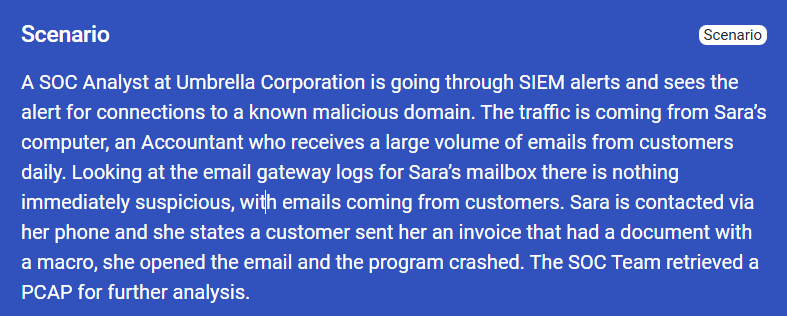
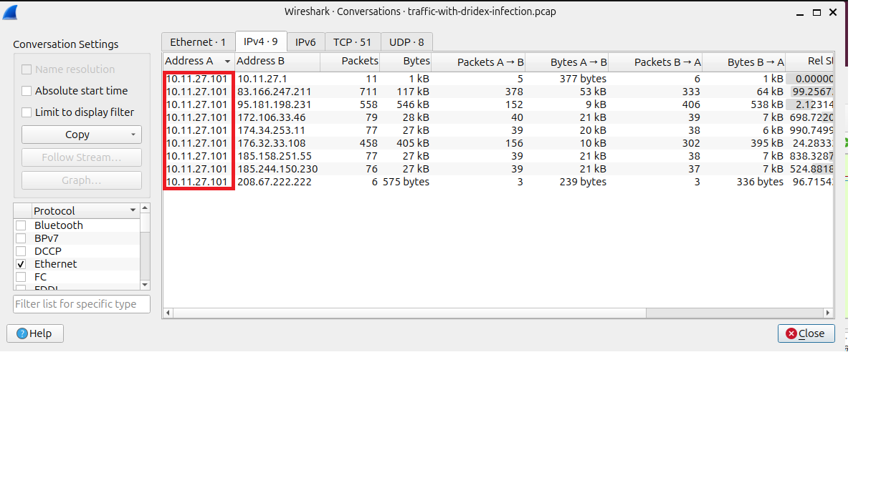
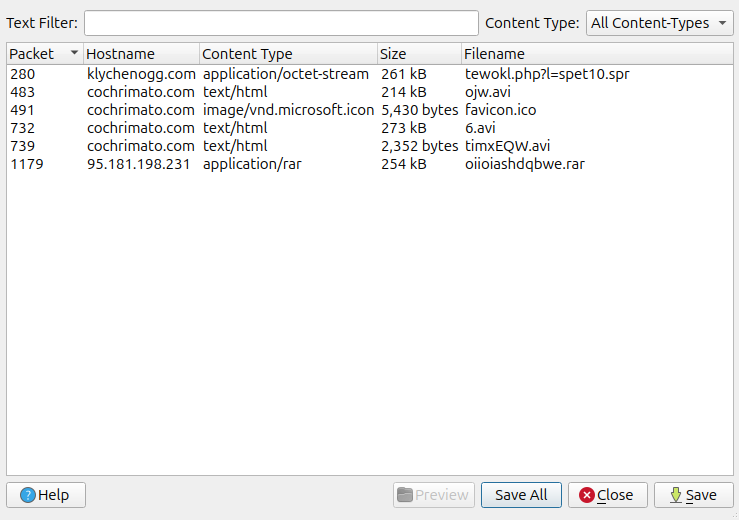
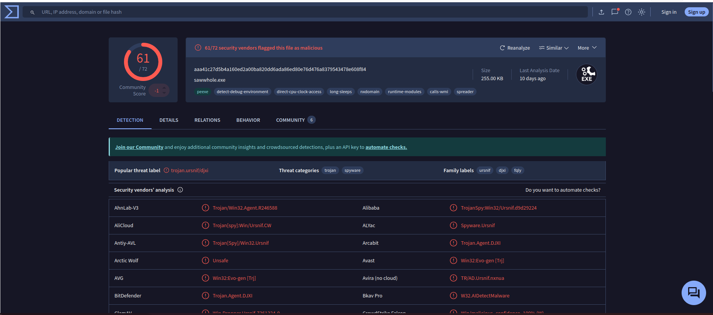
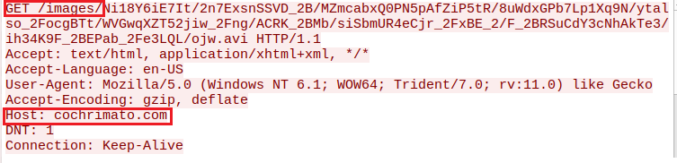
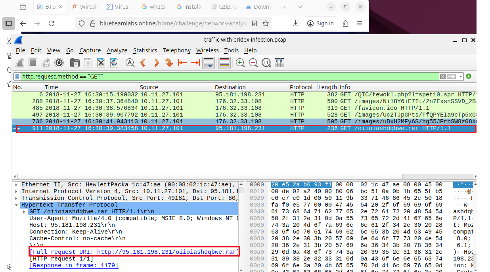

# Malware Compromise

**Category:** Network Analysis

**Link:** https://blueteamlabs.online/home/challenge/network-analysis-malware-compromise-e882f32908



### 01. What’s the private IP of the infected host?


### 02. What’s the malware binary that the macro document is trying to retrieve?

wireshark --> file --> export object (HTTP)

saved all files
```bash
for f int *;
do
    [-f "$f" ] && sha257sum "$f"
done
```
check each file and I saw this file was flagged as malware


### 03. From what domain HTTP requests with GET /images/ are coming from? 


I filtered wireshark by 'http.request.method == "GET"' and follow HTTP stream the packet 288

### 04. The SOC Team found Dridex, a follow-up malware from Ursnif infection, to be the culprit. The customer who sent her the macro file is compromised. What’s the full URL ending in .rar where Ursnif retrieves the follow-up malware from? 


### 05. What is the Dridex post-infection traffic IP addresses beginning with 185.?


### Tools
- virussTotal
- Cyberchef
- Zui