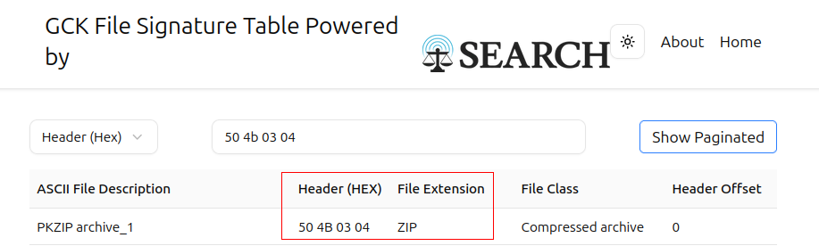
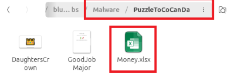
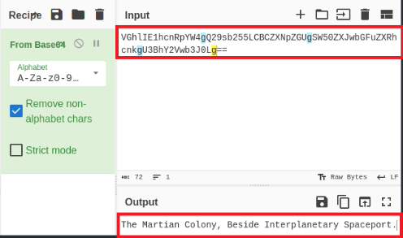
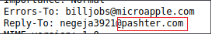

# The planet's prestige 

**Category** : phishing email

**Link** : https://blueteamlabs.online/home/challenge/the-planets-prestige-e5beb8e545

**Scenario**

## 01. What is the email service used by the malicious actor?

I look at the received fields and noticed that the first one seems to be suspicous.

## 02. What is the Reply-To email address? 

## 03. What is the filetype of the received attachment which helped to continue the investigation? 

I decode the content from base64 and convert it to hexadicimal code. I notice in first 4 couple-bytes (it's specified as a file format)

by searching, I find out the format of the file is "ZIP" while in the email, this file is pdf format ?? --> this thing seems to be like phishing

## 04. What is the name of the malicious actor?

## 05. What is the location of the attacker in this Universe? 

I saved the content in the email as Malware.zip file after I decoded it from base64, then I decode it, I look at the excel file.

in the excel file a see a code string then I decoded it so that I received the location of the attacker

## 06. What could be the probable C&C domain to control the attacker’s autonomous bots?

beacause this email associated with the attacker so I think this domain is regarding C2C server