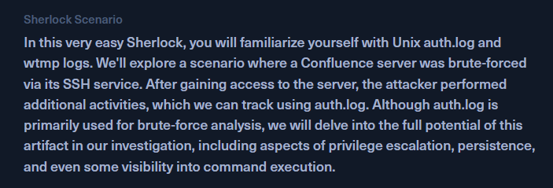
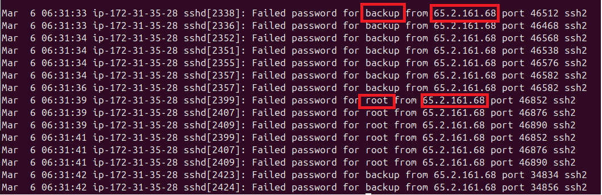
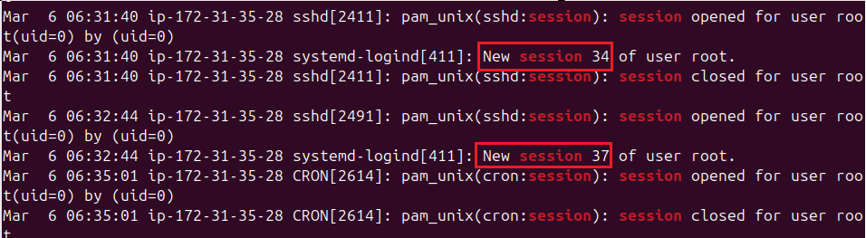
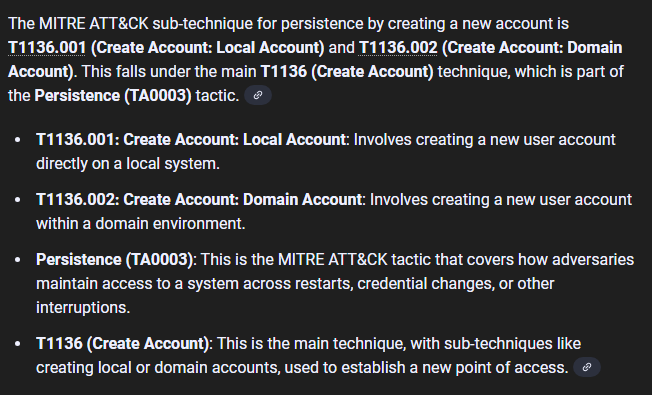

# Brutus

**Category:** bruteforce attack
**link:** https://app.hackthebox.com/sherlocks/brutus

## Scenario:


### Task 1 Analyze the auth.log. What is the IP address used by the attacker to carry out a brute force attack?


```bash
grep -i "failed password" auth.log | grep -v "invalid" 
```
### Task 2 The bruteforce attempts were successful and attacker gained access to an account on the server. What is the username of the account?

```bash
grep -i "failed password" auth.log | grep -v "invalid" | cut -d ' ' -f 10 | sort | uniq -c | sort -nr
```


>note : grep -v : exclude some elements, sort -nr : sort following numerical and reverse order

### Task 3 Identify the UTC timestamp when the attacker logged in manually to the server and established a terminal session to carry out their objectives. The login time will be different than the authentication time, and can be found in the wtmp artifact.

```bash
grep -i accepted auth.log | grep 65.2.161.68
```


```bash
utmpdump wtmp | grep "root"
```


### Task 4 SSH login sessions are tracked and assigned a session number upon login. What is the session number assigned to the attacker's session for the user account from Question 2?

```bash
grep -i root auth.log | grep "session"
```



-there are 2 session created:
    - the first one is in 1 second 
    - the second one is about 2 minutes


### Task 5 The attacker added a new user as part of their persistence strategy on the server and gave this new user account higher privileges. What is the name of this account?

in task 3 I noticed a new user cyberjunkie

### Task 6 What is the MITRE ATT&CK sub-technique ID used for persistence by creating a new account?


### Task 7 What time did the attacker's first SSH session end according to auth.log?


### Task 8 The attacker logged into their backdoor account and utilized their higher privileges to download a script. What is the full command executed using sudo?


the attacker do a command to read the password hash in "shadow" file and
installed something from github