# Bumblebee
**Link:** https://app.hackthebox.com/sherlocks/Bumblebee

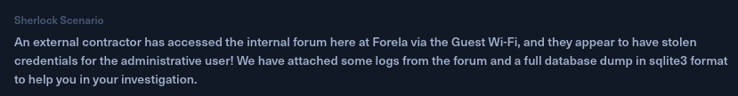

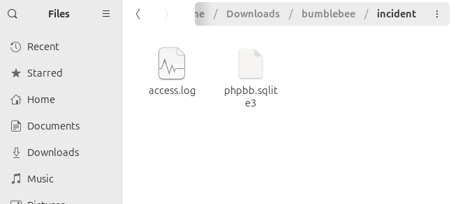
download the zip file and extract it, I recieved two file like this.

## Task

### 01. What was the username of the external contractor?

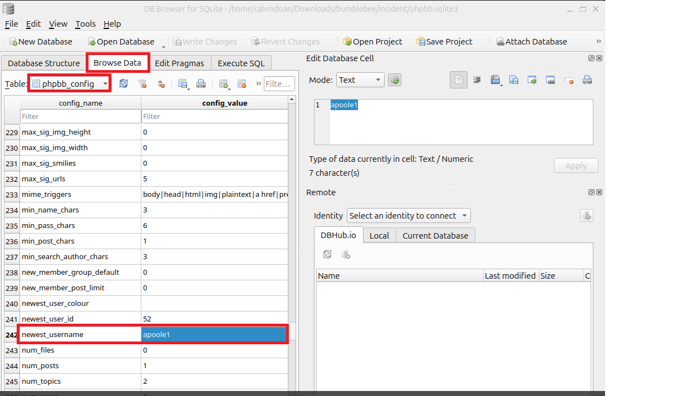
     
using DB Browser for SQLite --> Browse Data --> phpbb_config, I found out the username

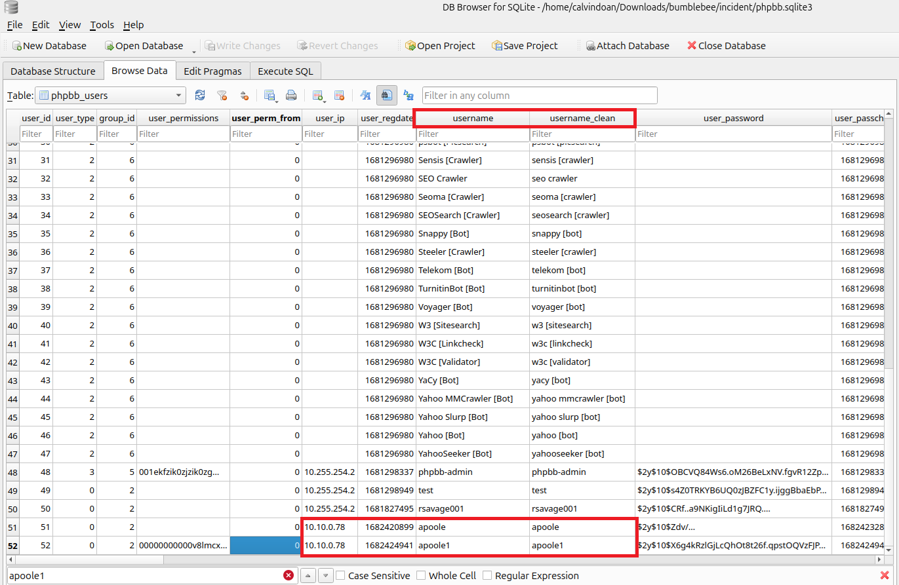

following this username, I found the relevant ip

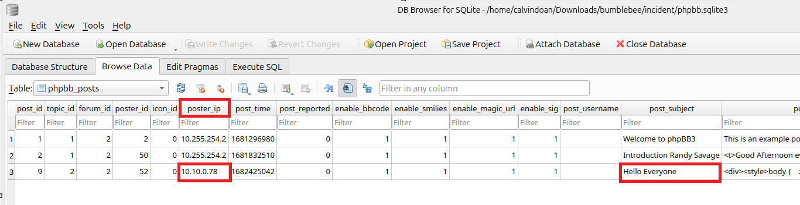

going to phpbb_posts, I saw the ip posting a subject that is "Hello everyone" so I think this is external extractor
Ans: apoole1

### 02. What IP address did the contractor use to create their account?
Ans: 10.10.0.78

### 03. What is the post_id of the malicious post that the contractor made?
Ans: 9

### 04. What is the full URI that the credential stealer sends its data to?
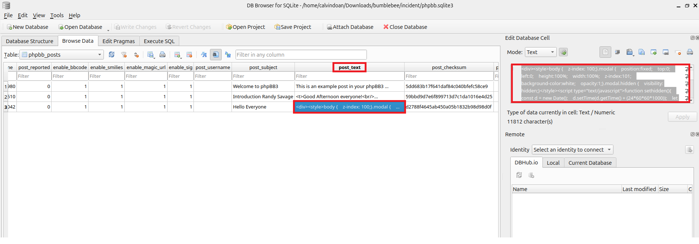
copy the post text 

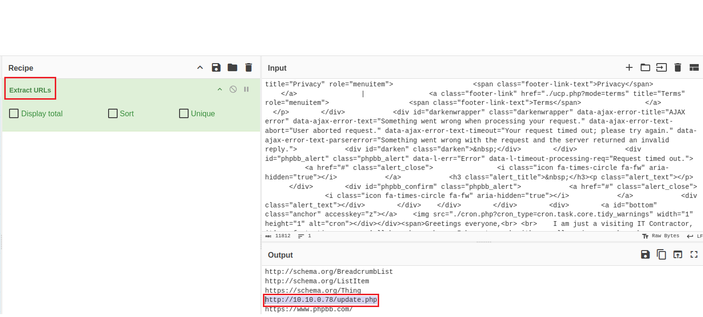
using cyberchef tool to extract the URLs, then I find out the URI that stealer sends its data.

### 05. When did the contractor log into the forum as the administrator? (UTC)
```bash
grep POST access.log | grep "10.10.0.78"
```
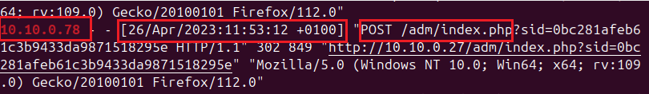
because UTC time is +0000 so the answer is: 23/04/2023 10:53:12


### 06. In the forum there are plaintext credentials for the LDAP connection, what is the password?
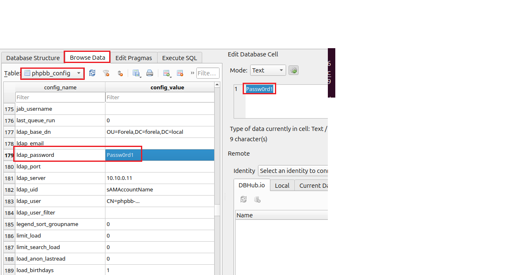

### 07. What is the user agent of the Administrator user?
```bash
cat access.log | cut -d ' ' -f 1,12-24 | sort | uniq -c | sort -nr | grep "10."
```
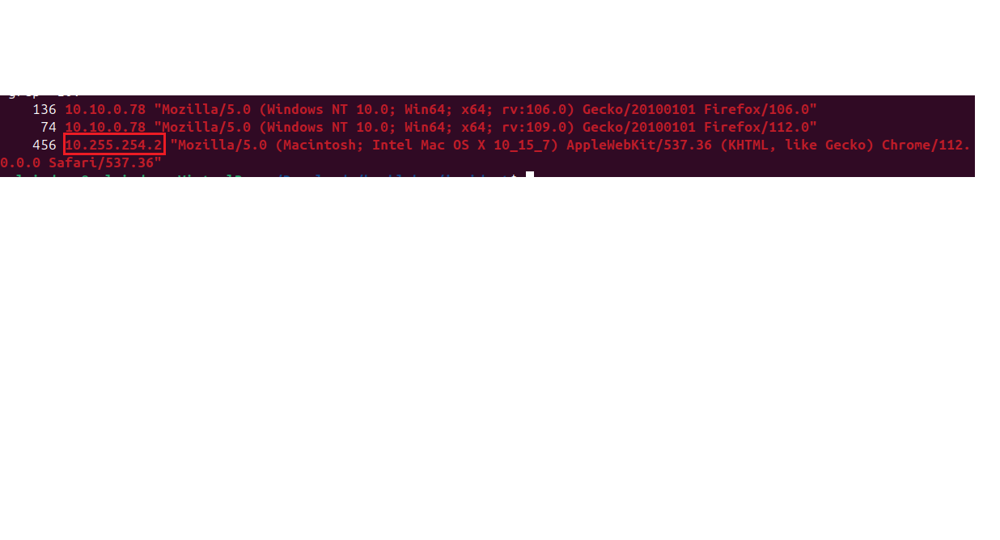

because 10.10.0.78 is stealer so the another one is real administrator.

### 08. What time did the contractor add themselves to the Administrator group? (UTC)
```bash
grep POST access.log | cut -d ' ' -f 1,4,7
```
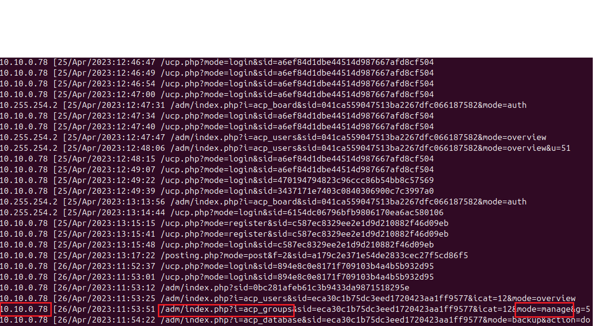
Ans: 26/04/2023 10:53:51

### 09. What time did the contractor download the database backup? (UTC)
```bash
grep GET access.log | cut -d ' ' -f 1,4,7,10
```
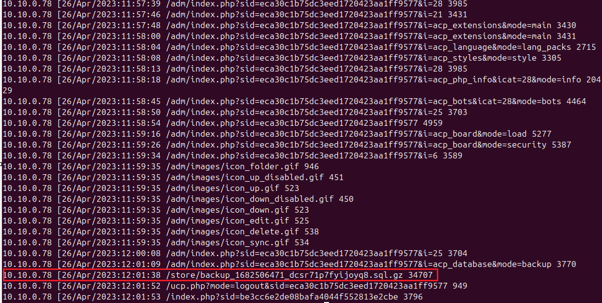

### 10. What was the size in bytes of the database backup as stated by access.log?
in the previous picture, take a look at the last element, this is the size in bytes of the database backup

ANS: 34707